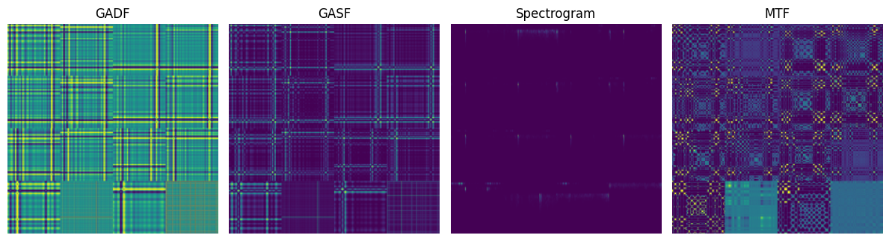
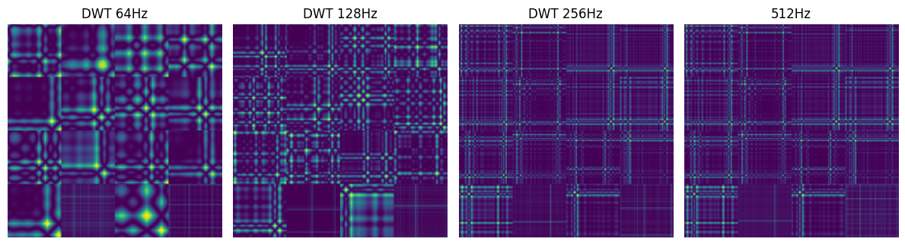

# Vision Transformers for Sleep Stage Classification (EEG → Image)

**Research question:** if you want a Vision Transformer (ViT) to score sleep stages from polysomnography (PSG), *how should you turn the 1-D physiological signals into images?*

This repository holds the code and the publications from an undergraduate research project (BSc (Hons) in Data Science, Department of Statistics, Faculty of Science, University of Colombo, 2025) by Janith R.R.H. Ramanayakage, supervised by [Dr. Chandima N.P.G. Arachchige](https://www.res.cmb.ac.lk/statistics/chandima-priyadarshani/). It uses the PhysioNet **CAP Sleep Database** and six-stage R&K scoring (Wake, S1, S2, S3, S4, REM).


## What was done

1. **Signal-to-image encodings.** Each 30-second epoch of 16 PSG channels is turned into an image with GASF, GADF, MTF or a spectrogram. The 16 channel images are tiled into a 4×4 grid (224×224).
2. **Pre-processing.** Band-pass and notch filtering, ICA artifact removal, and FFT or DWT down-sampling (512 → 256 / 128 / 64 Hz).
3. **Class balance.** A DCGAN generates synthetic images for under-represented stages.
4. **Classification.** ViTs, pre-trained (ImageNet) or from scratch, compared against other architectures and a ResNet-50 baseline.

### Headline findings (SICASH 2026 paper)

Subject-wise 5-fold cross-validation on 80 recordings (80,667 epochs):

| Question | Answer |
|---|---|
| Best image encoding? | **GASF**, 78.5% accuracy (GADF 77.2, MTF 75.8, spectrogram 74.1) |
| Best sampling rate and method? | **DWT at 128 Hz**, 80.3%, which is 1.8 points above the original 512 Hz signal |
| Does ImageNet pre-training help? | Yes: **+11.4 points** (86.2% vs 74.8% from scratch, balanced data) |
| Best model? | **ViT-B/16**, 86.2% accuracy, 0.853 macro-F1, 10 points above ResNet-50 |

The GASF-vs-GADF margin and the 128-vs-256 Hz margin are about the size of the fold-to-fold standard deviation, and no formal significance tests were run, so read those two rankings as indicative. See the [paper](publications/SICASH-2026) for limitations.

| Same epoch, four encodings | FFT vs DWT down-sampling |
|---|---|
|  |  |

## Publications

The work produced three publications. They run **different experiments with different numbers**, so compare figures only within one publication.

| Publication | Venue | Folder |
|---|---|---|
| *Systematic Evaluation of Signal-to-Image Transformation Pipelines for Vision Transformer-based Sleep Stage Classification*: paper, slides, speaker notes | SICASH 2026 | [publications/SICASH-2026](publications/SICASH-2026) |
| *Representation Separability of Signal-to-Image Transformations for Sleep Stage Classification Using Pretrained Vision Transformers*: abstract and extended abstract | ICDS 2025, Colombo | [publications/ICDS-2025](publications/ICDS-2025) |
| *Enhancing Sleep Stage Classification with Vision Transformers*: undergraduate thesis, defence slides, LaTeX source | University of Colombo, 2025 | [publications/Thesis-UOC-2025](publications/Thesis-UOC-2025) |

Chronology: thesis (March 2025) → ICDS 2025 → SICASH 2026. The thesis used a ~12,000-epoch subsample with random epoch-level splits. The ICDS work ranks 1,016 transformation/fusion/channel strategies by embedding separability. The SICASH paper re-runs the pipeline on 80 recordings with subject-wise cross-validation, so its numbers are the most rigorous. See [publications/README.md](publications/README.md).

## Where to start

| If you want to... | Go to |
|---|---|
| Understand the research in 5 minutes | the table above, then the [SICASH paper folder](publications/SICASH-2026) (README and slides) |
| Read the full study | [thesis](publications/Thesis-UOC-2025) for the most detail, the [SICASH paper](publications/SICASH-2026) for the most rigorous results |
| Run or extend the code | [docs/code-guide.md](docs/code-guide.md) |
| Know what may not match the papers | [docs/NOTES.md](docs/NOTES.md) |

## Repository layout

```
.
├── src/sleepvit/        Python package: data, models, training, evaluation
├── scripts/             One script per pipeline stage / experiment (00 … 10)
├── configs/             default.yaml with every setting
├── tests/               Unit tests (14)
├── docs/                Code guide, design notes, notebook map, shared figures
└── publications/
    ├── SICASH-2026/     Paper, slides, speaker notes
    ├── ICDS-2025/       Abstract and extended abstract
    └── Thesis-UOC-2025/ Thesis PDF, defence slides, LaTeX source
```

## Code and reproducibility status

Please read this before running anything.

- **Unit tests pass** (`pip install -e . && pytest`, 14 tests on parsing, resampling, image shapes and splits).
- **The experiments have not been run end to end** with this code base. It was assembled from the original research notebooks, and [docs/NOTES.md](docs/NOTES.md) lists where it deviates from them, including a band-pass filter bug in the notebooks that can change reported numbers.
- **The default config follows the thesis protocol**, not the SICASH one: random epoch-level splits (`experiments.split_by: epoch`), a 12,000-epoch subsample, an 8-bin MTF and a 64-sample spectrogram window. The SICASH paper used subject-wise 5-fold cross-validation, a 32-bin MTF, a 256-sample Hamming spectrogram and all 80 recordings. Setting `experiments.split_by=subject` gives subject-wise splits, but a full SICASH re-run needs further config and script changes.

```bash
git clone https://github.com/JanithRamanayake523/EEG2Img-ViT-Sleep-Staging.git
cd EEG2Img-ViT-Sleep-Staging
pip install -e ".[dev]"
pytest
```

The step-by-step commands for every experiment (images → transformations → sampling → pre-training → architectures → DCGAN → final model) are in [docs/code-guide.md](docs/code-guide.md).

## Data

CAP Sleep Database: <https://physionet.org/content/capslpdb/1.0.0/>. It is not redistributed here. Download the `.edf` files and `.txt` hypnograms and place them anywhere under `data/raw/` (git-ignored).

## Citation

```bibtex
@misc{ramanayakage2026signal2image,
  title  = {Systematic Evaluation of Signal-to-Image Transformation Pipelines for Vision Transformer-based Sleep Stage Classification},
  author = {Ramanayakage, Janith R.R.H. and Arachchige, Chandima N.P.G.},
  year   = {2026}
}
```

## Contact and license

Janith R.R.H. Ramanayakage: janithramanayake523@gmail.com. Released under the [MIT License](LICENSE).
