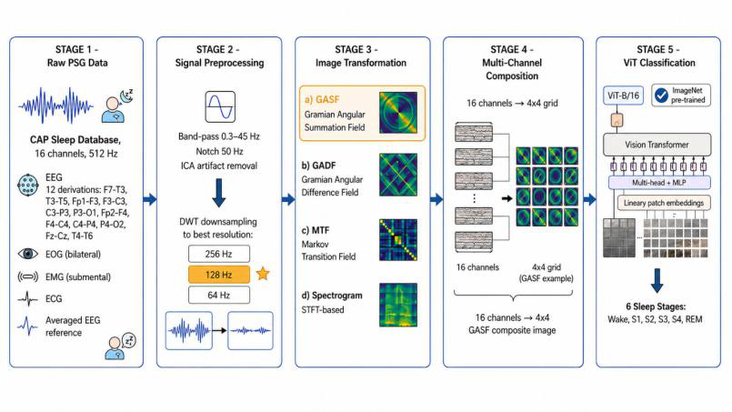

<div align="center">

# EEG2Img: Signal-to-Image Pipelines for ViT-based Sleep Staging

**Systematic Evaluation of Signal-to-Image Transformation Pipelines for Vision Transformer-based Sleep Stage Classification**

Janith R.R.H. Ramanayakage · Chandima N.P.G. Arachchige
*Department of Statistics, Faculty of Science, University of Colombo, Sri Lanka*


[Paper (PDF)](paper/Systematic%20Evaluation%20of%20Signal-to-Image%20Transformation%20Pipelines%20for%20Vision%20Transformer-based%20Sleep%20Stage%20Classification.pdf) · [Slides](presentation/Systematic%20Evaluation%20of%20Signal-to-Image%20Transformation%20Pipelines%20for%20Vision%20Transformer-based%20Sleep%20Stage%20Classification%20-%20Presentation.pptx) · [Code](src/)

</div>

---

## Highlights

- Compares **four signal-to-image encodings** (GASF, GADF, MTF, spectrogram) as input to Vision Transformers for six-stage sleep scoring.
- Finds that **GASF + DWT resampling to 128 Hz + a fine-tuned ImageNet ViT-B/16** is the best pipeline, reaching **86.2% accuracy** and **0.853 macro-F1**.
- Evaluated with **subject-wise 5-fold cross-validation** on 80 CAP recordings (80,667 epochs), so no subject appears in both training and test data.
- Class imbalance handled with **DCGAN synthetic augmentation applied to training folds only**.

## Abstract

Sleep stage classification is a prerequisite for diagnosing sleep disorders and assessing sleep quality. Existing ViT-based approaches to polysomnography (PSG) rely mainly on spectrogram or raw-signal inputs, and the best way to turn one-dimensional physiological signals into images for ViTs has not been systematically studied. This work evaluates GASF, GADF, MTF and spectrogram encodings on the CAP Sleep Database, studies the effect of sampling rate and resampling method (FFT vs DWT), and compares pre-trained and from-scratch models across seven architectures.

## Method



1. **Acquire**: 16-channel PSG at 512 Hz (12 EEG, EOG, EMG, ECG, averaged EEG reference).
2. **Preprocess**: 0.3–45 Hz band-pass, 50 Hz notch, ICA artifact removal, then FFT or DWT down-sampling to 256 / 128 / 64 Hz.
3. **Transform**: each channel is encoded as an image with GASF, GADF, MTF (32 bins) or an STFT spectrogram (Hamming, 256 samples, 50% overlap).
4. **Compose**: the 16 channel images are tiled into a 4×4 grid, resized to 224×224×3.
5. **Classify**: ImageNet pre-trained ViT-B/16 predicts one of six stages (Wake, S1, S2, S3, S4, REM) per 30-second epoch.

## Results

All values are mean ± SD over subject-wise 5-fold cross-validation.

**1. Image transformation** (pre-trained ViT-B/16, 512 Hz)

| Method | Accuracy (%) | Macro-F1 | Time (s/epoch) |
|---|---|---|---|
| **GASF** | **78.5 ± 0.8** | **0.773** | 0.2 |
| GADF | 77.2 ± 0.9 | 0.761 | 0.2 |
| MTF | 75.8 ± 1.1 | 0.748 | 5.0 |
| Spectrogram | 74.1 ± 1.0 | 0.732 | 0.4 |

**2. Sampling rate and resampling method** (GASF + pre-trained ViT-B/16)

| Frequency | FFT acc. (%) | DWT acc. (%) |
|---|---|---|
| 512 Hz (original) | 78.5 ± 0.8 | 78.5 ± 0.8 |
| 256 Hz | 77.8 ± 0.9 | 79.1 ± 0.7 |
| **128 Hz** | 76.2 ± 1.0 | **80.3 ± 0.7** |
| 64 Hz | 73.5 ± 1.2 | 75.9 ± 0.9 |

**3. Pre-training and class balance** (GASF + DWT 128 Hz)

| Model | Data | Accuracy (%) | Macro-F1 |
|---|---|---|---|
| **Pre-trained ViT-B/16** | Balanced | **86.2 ± 0.6** | **0.853** |
| Pre-trained ViT-B/16 | Imbalanced | 80.5 ± 0.8 | 0.789 |
| From-scratch ViT | Balanced | 74.8 ± 1.2 | 0.735 |
| From-scratch ViT | Imbalanced | 68.3 ± 1.4 | 0.662 |

**4. Architectures** (GASF + DWT 128 Hz, balanced data)

| Model | Accuracy (%) | Macro-F1 | Params (M) |
|---|---|---|---|
| **ViT-B/16** | **86.2 ± 0.6** | **0.853** | 86.6 |
| Swin-B | 85.1 ± 0.7 | 0.842 | 87.8 |
| BEiT-B | 84.6 ± 0.7 | 0.837 | 86.6 |
| DeiT-B | 84.3 ± 0.8 | 0.834 | 86.6 |
| ViT-B/32 | 83.2 ± 0.8 | 0.822 | 88.2 |
| PVT-Small | 81.8 ± 0.9 | 0.807 | 24.5 |
| ResNet-50 | 76.2 ± 0.5 | 0.751 | 25.6 |

> **Note on interpretation.** The GASF vs GADF margin (1.3 pp) and the 128 vs 256 Hz DWT margin (1.2 pp) are of similar size to the fold-to-fold standard deviation, and no formal significance tests were run, so those rankings are indicative. Comparisons with prior work differ in dataset, scoring convention (R&K vs AASM) and protocol. See the paper's Discussion for limitations.

## Repository structure

```
.
├── paper/          Paper (PDF), titled after the paper
├── presentation/   Slides and speaker notes
├── docs/figures/   Figures used in this README
└── src/            Source code (coming soon)
```

## Data

Experiments use the **CAP Sleep Database** from PhysioNet:

- Terzano et al. (2001), *Atlas, rules, and recording techniques for the scoring of cyclic alternating pattern (CAP) in sleep*, Sleep Medicine.
- Goldberger et al. (2000), *PhysioBank, PhysioToolkit, and PhysioNet*, Circulation.

Download: <https://physionet.org/content/capslpdb/1.0.0/>. The data is not redistributed in this repository.

## Roadmap

- [x] Paper
- [x] Presentation slides
- [ ] Source code release (`src/`)
- [ ] Reproduction instructions for all paper tables
- [ ] Trained model weights

## Citation

If you use this work, please cite:

```bibtex
@misc{ramanayakage2026signal2image,
  title     = {Systematic Evaluation of Signal-to-Image Transformation Pipelines for Vision Transformer-based Sleep Stage Classification},
  author    = {Ramanayakage, Janith R.R.H. and Arachchige, Chandima N.P.G.},
  year      = {2026}
}
```

## Contact

Janith R.R.H. Ramanayakage: janithramanayake523@gmail.com
